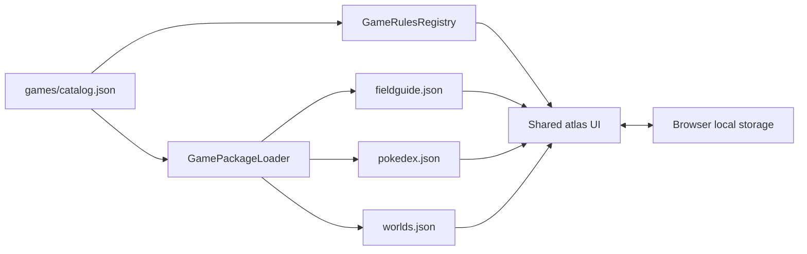

# Architecture

## Purpose

Pokemon Field Guide is a static Blazor WebAssembly application. The atlas UI and persistence model are shared, while each supported game family supplies a self-contained package of metadata, guide data, maps, sprites, and exceptional rules.

FireRed and LeafGreen are two independently tracked games represented as versions in the shared `frlg` package. A future pair sharing map topology, assets, data formats, and mechanics should normally be one additional package with two version definitions, not two packages. Package membership is an implementation and resource-sharing boundary; it must not collapse version-specific progress or user-facing backup choices.

## Runtime data flow



At startup, `Home.razor` loads saved preferences and the catalog. It selects `SavedProgress.GameId`, falling back to `GameCatalog.DefaultGameId`, and asks `GamePackageLoader` to fetch the package's guide, Pokédex, and world documents concurrently. The package's `rules` value resolves an `IGameRules` implementation through `GameRulesRegistry`.

The page renders versions, regions, Pokédex modes, labels, paths, defaults, and colors from `GameDefinition`. Title-specific exceptions are delegated to `IGameRules`.

## Source layout

```text
PokemonFieldGuide/
├── Models/
│   ├── FieldGuideData.cs       Generated-data and saved-progress contracts
│   ├── GamePackage.cs          Catalog and package metadata contracts
│   └── SaveBackup.cs           Portable save interchange contract
├── Pages/
│   └── Home.razor              Shared atlas, checklist, interiors, and Pokédex UI
├── Services/
│   ├── GamePackageLoader.cs    Catalog and package loading
│   └── GameRules.cs            Rules interface, registry, and providers
└── wwwroot/
    ├── games/
    │   ├── catalog.json
    │   └── <game-id>/
    │       ├── data/
    │       ├── maps/
    │       └── sprites/
    ├── css/app.css
    └── index.html
tools/
├── README.md                   Tooling ownership conventions
└── <game-id>/                  Package-specific extraction and rendering
```

Game-owned files must remain below `wwwroot/games/<game-id>/`. Global static files are limited to application-wide resources such as the shell, stylesheet, PWA icons, and service worker.

Build-time tooling follows the same ownership boundary. Scripts under `tools/<game-id>/` may understand that game's source project and formats, but must emit only the matching game package. Only utilities whose contracts are genuinely independent of a particular game belong in shared tooling.

## Shared models

`FieldGuideData` contains areas. Each `GuideArea` can contain:

- wild `Encounter` rows, filtered by version;
- visible, hidden, or event `GuideItem` rows;
- static, gift, or trade `SpecialPokemon` rows;
- `MapEntrance` edges to other areas;
- an optional rendered map and its pixel dimensions.

`GuideWorld` describes one connected outdoor canvas. Its `WorldMapPlacement` records use pixel coordinates and dimensions. Encounter and item coordinates use game-map tile coordinates; the current renderer places their markers at the center of a 16-pixel tile.

`PokedexEntry.Availability` is keyed by version ID. `RegionalNumber` is nullable so the same document supports regional and full-dex views.

## Package metadata

The catalog is deserialized into `GameCatalog` and `GameDefinition`. A definition owns:

- identity and display text;
- its rules-provider ID;
- data and asset paths;
- versions and their accent colors;
- visible region tabs and their world IDs;
- available Pokédex modes;
- initial world and area IDs.

Paths are URLs relative to `wwwroot` and must not start with `/`. This makes them compatible with both root hosting and a GitHub Pages repository base path.

## Rules boundary

`IGameRules` is the boundary for behavior that cannot be expressed by current package metadata:

- normalizing map IDs used by world placements and area data;
- naming and ordering encounter groups;
- ordering special-Pokémon and item groups;
- mapping species and item names to sprite filenames;
- supplying an embedded Pokémon icon when no file exists.

The shared page must not test game IDs, game titles, or title-specific map constants. Add metadata when the behavior is declarative; add or extend a rules implementation when it is procedural.

## Map and interior behavior

Outdoor areas are those referenced by any loaded `GuideWorld`. `NormalizeAreaId` allows a rendered placement to resolve to a differently named guide area when source data requires it.

Interior reachability is graph-based. An outdoor warp is followed through empty transition maps until the nearest interior containing encounters, items, or special Pokémon is found. Once open, all non-outdoor areas connected through entrance edges become selectable floors. Consequently, complete and correct entrance edges are essential even for rooms with no checklist content.

Adjacent warp tiles resolving to the same target are clustered into a single entrance marker. Separate entrance clusters remain separate markers.

## Saved progress

The storage key remains `frlg-field-guide-v1` for compatibility. Despite its historical name, it stores all packages.

Checklist profiles are keyed as `<game-id>:<version-id>`, preventing collisions between packages with similarly named versions. Selected versions and Pokédex modes are remembered per package; theme and sprite-animation preferences are global. Resetting progress clears profiles and their schema-version records while retaining preferences.

The local-storage envelope is formally format v1 through `SavedProgress.FormatVersion`. Each profile also has an independent schema version in `SavedProgress.ProfileVersions`, keyed by the same composite key, whose current target is declared by the catalog version's `progressVersion`. This lets one game evolve without forcing unrelated profiles or shared assets to change version. Version 1 is the first released contract; unversioned development data is intentionally unsupported. Changing the storage key, envelope, profile shape, or checklist IDs requires an explicit migration plan.

Portable backups are a separate, public interchange contract, finalized at `SaveBackup.FormatVersion` v1. Users select individual games (version profiles), which remain grouped by package ID in the serialized document to avoid duplicating package metadata. Every exported profile carries its game-specific schema version. Import migrates older released profile schemas forward, replaces only recognized profiles present in the file, and preserves sibling-version, other-package, and global preference data. See [Save backups](save-backups.md) for the complete contract and mandatory versioning rules.

## Browser integration

`wwwroot/index.html` owns functions that must exist before Blazor starts:

- local-storage load/save;
- early theme/accent application to prevent a startup flash;
- menu-sprite frame animation, with Pokédex animation limited by `IntersectionObserver` to sprites inside the visible viewport;
- pointer-based map pan and zoom;
- base-map load gating so overlays do not appear first.

`Home.razor` invokes these functions through `IJSRuntime`. Map transforms are browser-side to keep pointer movement immediate and avoid a Blazor render on every frame.
