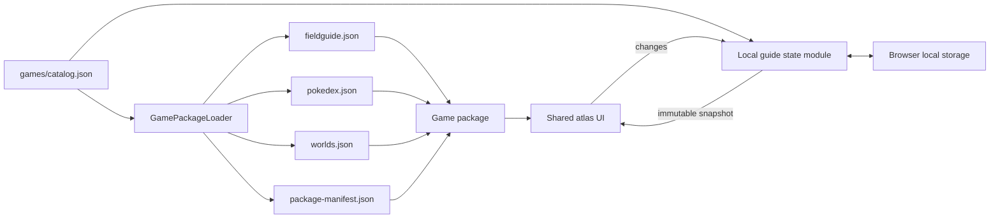

# Architecture

## Purpose

Pokemon Field Guide is a static Blazor WebAssembly application. The atlas UI and persistence model are shared, while each supported game family supplies a self-contained package of metadata, guide data, maps, sprites, and exceptional rules.

FireRed and LeafGreen are two independently tracked games represented as versions in the shared `frlg` package. A future pair sharing map topology, assets, data formats, and mechanics should normally be one additional package with two version definitions, not two packages. Package membership is an implementation and resource-sharing boundary; it must not collapse version-specific progress or user-facing backup choices.

## Runtime data flow



At startup, `Home.razor` loads the catalog and opens a `LocalGuideSession`. The session validates and migrates the Local guide state before it publishes an immutable snapshot. `Home.razor` then loads the active Game package from that snapshot. `GamePackageLoader` fetches the guide, Pokédex, world, and manifest documents concurrently and returns an assembled `GamePackage`.

The Game package owns normalized area lookup, version-aware queries, entrance traversal, marker clustering, ordered groups, asset resolution, and Pokédex interpretation. The Local guide state module owns preferences, Checklist profiles, profile migrations, portable backups, reset rules, and browser persistence. `Home.razor` owns temporary interaction state, file selection, downloads, and messages. The page renders versions, regions, Pokédex modes, labels, paths, defaults, and colors from `GameDefinition`.

## Source layout

```text
PokemonFieldGuide.Shared/
└── Contracts/                  Authoritative C# JSON contracts and serialization settings
PokemonFieldGuide/
├── Components/
│   └── ResourceDetails.razor   Shared fixed and multi-outcome resource details
├── Pages/
│   └── Home.razor              Shared atlas, checklist, interiors, and Pokédex UI
├── Services/
│   ├── ChecklistProgressMigrations.cs  Released package ID migrations
│   ├── GamePackageLoader.cs    Catalog and package loading
│   ├── GamePackage.cs          Read-only package queries and indexes
│   └── LocalGuideState.cs      Local state, profile rules, backups, and storage adapters
└── wwwroot/
    ├── games/
    │   ├── catalog.json
    │   └── <game-id>/
    │       ├── data/
    │       ├── maps/
    │       └── sprites/
    ├── css/app.css
    └── index.html
tools/
├── PokemonFieldGuide.SchemaGenerator/  JSON Schema generation and drift check
├── package-schema/             Generated-document schema validation
├── README.md                   Tooling ownership conventions
├── package-finalization/       Shared package transforms, checks, and replacement
├── package-finalization.test.mjs
└── <game-id>/                  Package-specific extraction and rendering
```

Game-owned files must remain below `wwwroot/games/<game-id>/`. Global static files are limited to application-wide resources such as the shell, stylesheet, PWA icons, and service worker.

Build-time tooling follows the same ownership boundary. Scripts under `tools/<game-id>/` may understand that game's source project and formats. They return draft data and staged assets to package finalization. Package finalization applies every package invariant, writes the final documents, removes unreferenced assets, and replaces only the matching game package after all checks pass. See [Package finalization](package-finalization.md).

## Shared models

`FieldGuideData` contains areas. Each `GuideArea` can contain:

- wild `Encounter` rows, filtered by version;
- visible, hidden, or event `GuideItem` rows;
- renewable, non-checklist `GuideMapResource` rows with optional comments and reward outcomes;
- static, gift, or trade `SpecialPokemon` rows;
- `MapEntrance` edges to other areas;
- an optional rendered map and its pixel dimensions.

`GuideWorld` describes one connected outdoor canvas. Its `WorldMapPlacement` records use pixel coordinates and dimensions. Item, entrance, and resource coordinates use game-map tile coordinates. The current renderer places their markers at the center of a 16-pixel tile.

A fixed-output resource uses the item name as its marker name. A multi-outcome resource has reward rows with a name and quantity. Random pools use positive integer weights, while conditional pools omit weights and explain each outcome in its comment. Package finalization rejects a pool that mixes the two forms.

`PokedexEntry.Availability` is keyed by version ID. `RegionalNumber` is nullable so the same document supports regional and full-dex views.

## Package metadata

The catalog is deserialized into `GameCatalog` and `GameDefinition`. A definition owns:

- identity and display text;
- data and asset paths;
- versions and their accent colors;
- visible region tabs and their world IDs;
- available Pokédex modes;
- initial world and area IDs.

Paths are URLs relative to `wwwroot` and must not start with `/`. This makes them compatible with both root hosting and a GitHub Pages repository base path.

## Package variability

The package manifest is the runtime authority for area aliases and Pokémon sprite filenames. Package finalization writes manifest format v2 and validates the same document that `GamePackageLoader` reads. Every sprite is a file owned by its Game package. Runtime code contains no embedded image data.

Each `Encounter` retains its source `Method` and has a normalized `EncounterType`. A Game adapter must classify every source method. Package generation fails when a method is not classified. C# owns encounter-group labels and ordering through an exhaustive mapping from `EncounterType`.

`GamePackage` hides manifest lookup, grouping, ordering, and asset resolution from the shared page. The page must not test game IDs, game titles, or title-specific map constants.

## Map and interior behavior

Outdoor areas are those referenced by any loaded `GuideWorld`. The Game package indexes those placements during assembly. `NormalizeAreaId` allows a rendered placement to resolve to a differently named guide area when source data requires it.

Interior reachability is graph-based. An outdoor marker opens the nearest interior that contains encounters, items, resources, special Pokémon, or an explicit `IncludeInNavigation` value. Once open, every connected non-outdoor area with guide data becomes a selectable floor. Package finalization contracts empty transition chains but retains a junction when distinct branches lead to relevant interiors, even when the branches have different lengths. Complete and correct source entrance edges are therefore essential for rooms that are omitted from the final package.

Adjacent warp tiles resolving to the same target are clustered into a single entrance marker. Separate entrance clusters remain separate markers.

An area checklist contains each version-available Pokémon species once, across both encounters and special acquisitions, plus every item in the area. Renewable resources are informational markers and never enter checklist state. The page compares the checklist with the active Checklist profile to calculate the displayed percentage.

## Local guide state

The storage key remains `frlg-field-guide-v1` for compatibility. Despite its historical name, it stores all packages.

Checklist profiles are keyed as `<game-id>:<version-id>`, preventing collisions between packages with similarly named versions. Selected versions and Pokédex modes are remembered per package. Theme and sprite-animation preferences are global.

The browser-local envelope remains format v1. Each profile has an independent schema version keyed by the same composite key. The catalog version's `progressVersion` declares the target. This lets one game evolve without forcing unrelated profiles or shared assets to change version. Unversioned data is unsupported.

`LocalGuideSession` exposes an immutable snapshot and intent-named changes. It queues changes within one browser tab. Every change builds a proposed document, writes it through the browser storage adapter, and publishes the snapshot only after the write succeeds. A failed write leaves the page and browser storage on the prior state.

Normal reset lists only non-empty Checklist profiles and clears the profiles selected by the user. Preferences remain unchanged. If the Local guide state cannot be read, the recovery result retains the exact stored text for download. Recovery deletion removes the complete local document and starts from defaults.

Portable backup v2 contains only selected Checklist profiles and their profile versions. Backup import accepts v1 and v2, previews recognized profiles, and applies only the profiles confirmed by the user. See [Checklist backup format](save-backups.md) for the serialized contracts and migration rules.

## Browser integration

`wwwroot/index.html` owns functions that must exist before Blazor starts:

- raw local-storage read, write, and delete;
- early theme/accent application to prevent a startup flash;
- menu-sprite frame animation, with Pokédex animation limited by `IntersectionObserver` to sprites inside the visible viewport;
- pointer-based map pan and zoom;
- base-map load gating so overlays do not appear first.

`Home.razor` invokes these functions through `IJSRuntime`. Map transforms are browser-side to keep pointer movement immediate and avoid a Blazor render on every frame.
